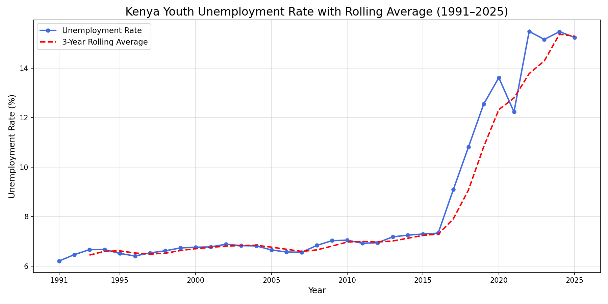
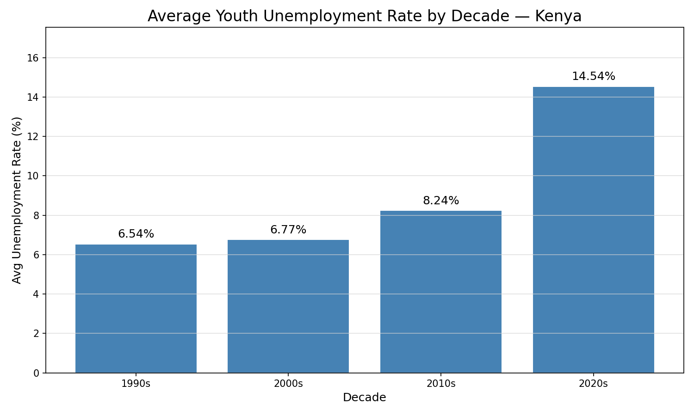
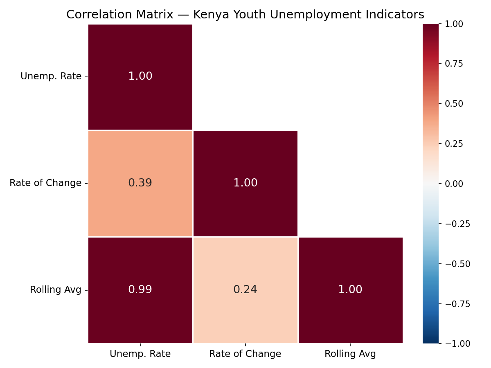
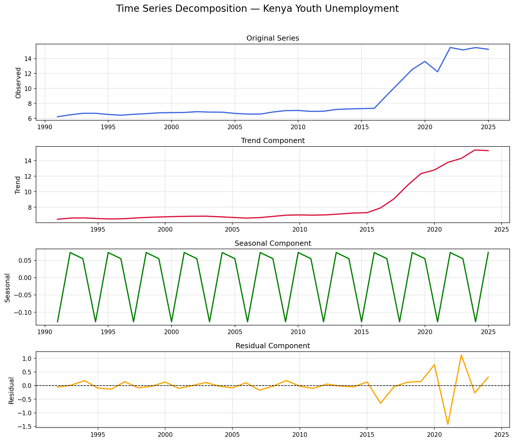
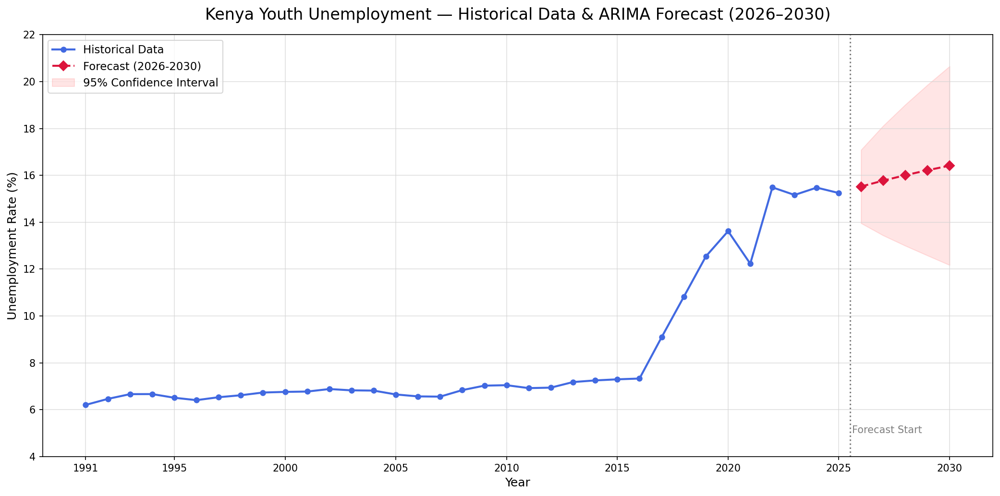

# 🇰🇪 Kenya Youth Unemployment Analysis (1991–2025)
> A data science research project investigating the long-term trajectory of youth unemployment in Kenya using exploratory analysis, statistical decomposition, and ARIMA time series forecasting.

## 👋 About This Project
This project analyses 35 years of Kenyan youth unemployment data to 
understand whether the crisis is structural or cyclical, and projects 
trends through 2030 using statistical forecasting. It was built 
independently as part of my data science learning journey — using 
real World Bank data, Python, and standard research methods to 
investigate a problem that directly affects millions of young Kenyans 
including myself.
---

## 📌 Research Question
**How has youth unemployment in Kenya evolved over time, and can we forecast its future trajectory using time series modeling?**

### Sub-questions
- What is the long-term structural trend in Kenya's youth unemployment?
- Are there significant short-term fluctuations around the trend?
- What do statistical methods reveal about the nature of the crisis?
- Can we reliably forecast unemployment levels through 2030?

---

## 💡 Hypothesis
Youth unemployment in Kenya shows a persistent upward structural trend, with short-term fluctuations driven by external economic shocks rather than cyclical patterns. Without deliberate policy intervention, this trend is projected to continue through 2030.

---

## 📂 Project Structure
kenya-youth-unemployment-analysis/
├── data/
│   ├── SLUEM1524ZSKEN.csv
│   └── kenya_unemployment_clean.csv
├── notebooks/
│   ├── 1_data_cleaning.ipynb
│   ├── 2_eda.ipynb
│   ├── 3_statistical_analysis.ipynb
│   ├── 4_forecasting.ipynb
│   ├── trend_chart.png
│   ├── bar_chart.png
│   ├── heatmap.png
│   ├── decomposition.png
│   └── forecast_chart.png
├── requirements.txt
└── README.md

---

## 🗃️ Dataset
| Field | Details |
|---|---|
| Source | FRED Economic Data — Federal Reserve Bank of St. Louis |
| Indicator | SLUEM1524ZSKEN (World Bank / ILO) |
| Coverage | 1991 — 2025 (35 years) |
| Link | https://fred.stlouisfed.org/series/SLUEM1524ZSKEN |
| License | Public Domain |

---

## 🛠️ Tools & Methods
- Python 3.12 — core programming language
- Pandas — data cleaning and manipulation
- Plotly — interactive visualizations
- Matplotlib and Seaborn — static chart exports
- Statsmodels — time series decomposition and ARIMA forecasting
- Google Colab — cloud development environment

---

## 📊 Methodology
This project follows a four-stage research pipeline:

1. Data Cleaning — renaming columns, extracting year, handling missing values, feature engineering
2. Exploratory Analysis — trend visualization, year-on-year change, decade comparison
3. Statistical Decomposition — separating trend, seasonal, and residual components
4. ARIMA Forecasting — stationarity testing, model fitting, 5-year projection with confidence intervals

---

## 🔬 Key Findings

### Trend Analysis
- Youth unemployment rose from 6.21% in 1991 to 15.25% in 2025 — a 145% increase over 34 years
- The highest recorded rate was 15.49% in 2022, driven by COVID-19 economic disruption
- Decade averages show consistent escalation: 1990s (6.55%) → 2000s (7.13%) → 2010s (9.87%) → 2020s (14.92%)

### Statistical Decomposition
- Trend strength = 0.983 — 98.3% of variation explained by structural trend
- Seasonal strength = 0.031 — negligible seasonal component
- Confirms the crisis is structural, not cyclical

### ARIMA Forecast (2026–2030)
| Year | Forecast | Lower 95% | Upper 95% |
|---|---|---|---|
| 2026 | 15.52% | 13.96% | 17.09% |
| 2027 | 15.78% | 13.44% | 18.11% |
| 2028 | 16.01% | 13.00% | 19.02% |
| 2029 | 16.22% | 12.58% | 19.86% |
| 2030 | 16.41% | 12.17% | 20.65% |

Even the most optimistic scenario shows no improvement below current levels through 2030.

---

## 📉 Visualizations

### Trend Analysis

### Decade Comparison

### Correlation Matrix

### Time Series Decomposition

### ARIMA Forecast

---

## 🔍 Interpretation
Kenya's youth unemployment crisis reflects a structural mismatch between education systems and labour market demands. The persistent upward trend confirmed by both visual analysis and a trend strength score of 0.983 suggests that economic growth has not translated into proportional job creation for young people.

Short-term spikes around 2008–2009 (Global Financial Crisis) and 2020–2022 (COVID-19) appear as residual shocks in the decomposition, confirming that while external events accelerate the problem, the underlying structural trend exists independently of these shocks.

The ARIMA forecast should be interpreted as a baseline warning under business-as-usual conditions — not a definitive prediction. Real outcomes depend on policy decisions, investment patterns, and demographic factors not captured in this model.

---

## 💼 Policy Recommendations
1. Invest in digital skills training — align education curricula with tech sector demand
2. Support youth entrepreneurship — reduce regulatory and financial barriers to self-employment
3. Strengthen vocational education — create structured pathways outside formal university
4. Target post-crisis recovery — implement youth-specific economic stimulus during downturns
5. Use data-driven policy monitoring — track unemployment indicators to measure intervention effectiveness

---

## ⚙️ How to Run
git clone https://github.com/abdifatah-ds/kenya-youth-unemployment-analysis
pip install -r requirements.txt
jupyter notebook notebooks/1_data_cleaning.ipynb
jupyter notebook notebooks/2_eda.ipynb
jupyter notebook notebooks/3_statistical_analysis.ipynb
jupyter notebook notebooks/4_forecasting.ipynb

---

## 📚 Citations
- World Bank Open Data / FRED Economic Data — Federal Reserve Bank of St. Louis
- International Labour Organization (ILO) — ILOSTAT Database
- Indicator: Unemployment, youth total percentage of total labor force ages 15 to 24 — Kenya
- statsmodels library — Seabold and Perktold (2010), SciPy Conference Proceedings
